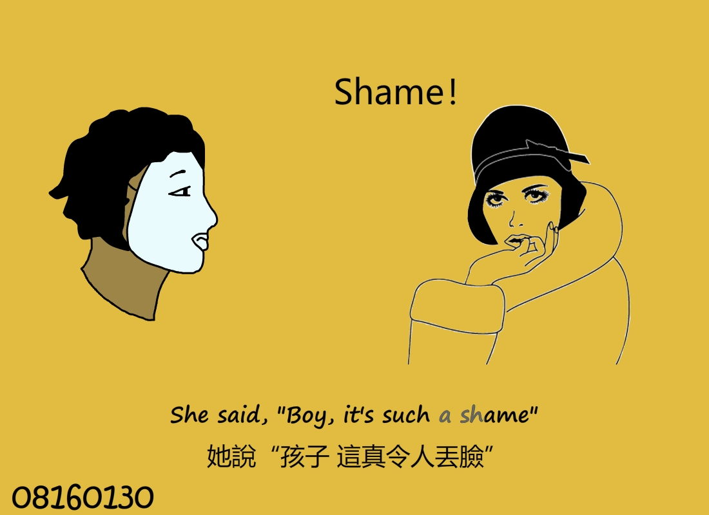

# Animate CC — 2D 動畫製作：Fake Friends | Animate CC — 2D Animation: Fake Friends


## 📌 Overview
本專案為我在初期接觸 2D 動畫時使用 Adobe Animate CC 所製作，  
前期以 **復活節主題** 為主題進行簡單場景與角色動畫練習，  
期末作品則結合自己喜歡的歌曲《Fake Friends》，  
設計完整的歌詞動畫與配套角色表演，呈現 MV 形式的 2D 動畫短片。

---

## 🧰 Technologies
- **Adobe Animate CC (.fla)**
- **時間軸動畫**
- **向量插圖與逐幀動畫**

---

## 🎯 Key Features
- 復活節主題插圖 + 角色動畫初步練習
- 自選歌曲搭配動態歌詞與角色演出
- 以 Animate CC 製作完整 2D MV 動畫流程
- 強化手繪風格與場景轉場設計


## 📂 How to Run
```bash
1. 使用 Adobe Animate CC 開啟 FakeFriends.fla
2. 於時間軸檢視各段動畫分鏡與插圖
3. 按 Ctrl + Enter 播放完整動畫效果
```

---

## 🎥 Demo 影片
以下為本專案執行過程影片：
[👉 點此觀看 Demo 影片](https://drive.google.com/file/d/1QWFVrIhnoS8rd9Efw9S22oNrUGbadP7e/view?usp=sharing)


---

## 📸 動畫場景截圖

| 場景 | 場景 |
|--------|--------|
|  |  |
|  |  |
