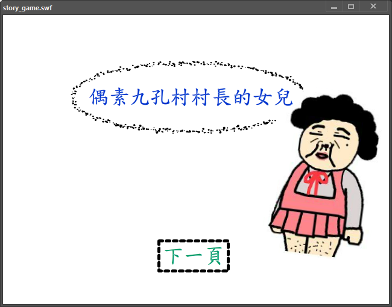
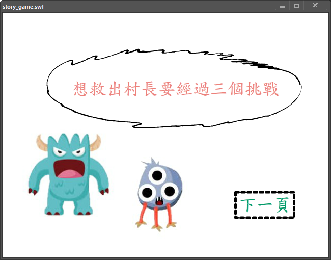
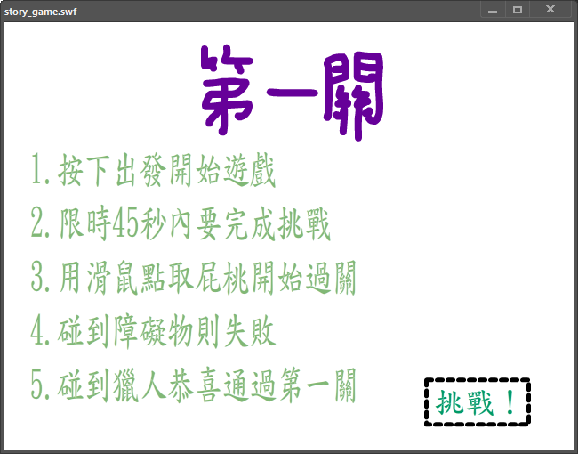
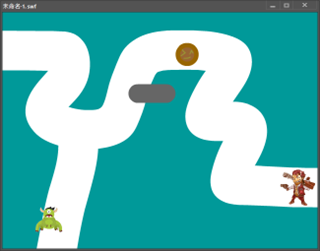

# Animate CC — 互動故事遊戲設計 | Interactive Story-based Mini Games


## 📌 Overview
本專案為 Adobe Animate CC 互動遊戲設計練習，  
設計一款具故事性的多關卡遊戲，包含：
- **電流急急棒**：玩家需控制指標沿著細線移動，避免碰觸邊界
- **射氣球**：射擊移動中的氣球，累積分數
- **打磚塊**：操控球反彈擊碎磚塊，挑戰高分

透過 Animate CC 時間軸動畫、元件與 ActionScript 實現完整互動邏輯。

---

## 🧰 Technologies
- **Adobe Animate CC (.fla)**
- **ActionScript 3.0**
- **元件符號、按鈕、場景管理**

---

## 🎯 Key Features
- 使用 Animate CC 建立場景與角色元件
- 撰寫簡易 ActionScript 控制移動與碰撞
- 遊戲包含基本得分或結束條件

---

## 📂 How to Run
```bash
1. 使用 Adobe Animate CC 開啟 story_game.fla
2. 進入主場景查看場景結構、按鈕元件與 ActionScript
3. 按 Ctrl + Enter 執行遊戲，體驗完整流程
```

---

## 📸 Game Screen

<table>
  <tr>
    <th>主畫面</th>
    <th>故事</th>
  </tr>
  <tr>
    <td></td>
    <td></td>
  </tr>

  <tr>
    <th>規則</th>
    <th>電流急急棒</th>
  </tr>
  <tr>
    <td></td>
    <td></td>
  </tr>
</table>
