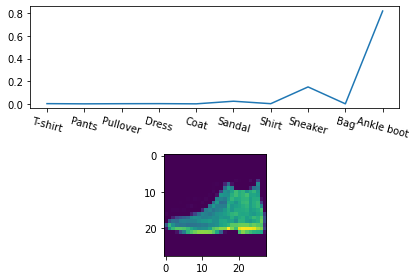
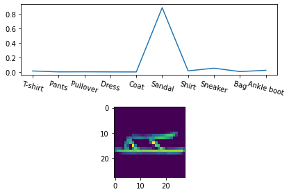

# Project Title

## 📌 Overview
使用 Jupyter Notebook 開發的服裝影像分類專案，透過 RNN 與 CNN 模型建立服裝影像分類系統，從前期資料收集、標註到模型訓練與測試完整實作，提升服裝自動化辨識準確度。

## 🧰 Technologies
- Python
- Jupyter Notebook
- TensorFlow / PyTorch
- OpenCV

## 🎯 Key Features
- 圖像資料收集與前處理
- RNN & CNN 訓練與測試
- 影像分類結果輸出

## 📂 How to Run
1. 在本機開啟 `clothing_recognition.ipynb`  
2. 依序執行每個 Cell  
3. 可選擇使用 `code/clothing_recognition.py` 執行整個流程

## 📊 Demo

## 📄 Related Report
[👉 點此下載 文字說明檔](./report_word.pdf)
[👉 點此下載 簡報檔](./report_ppt.pdf)

