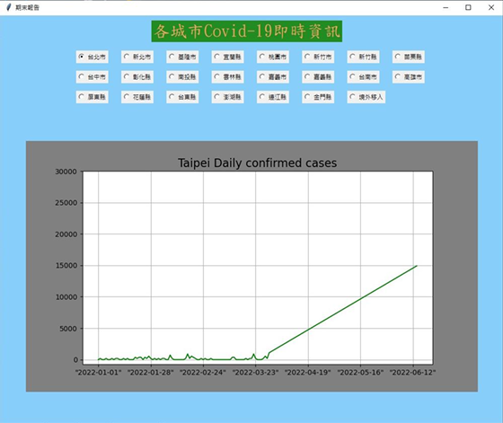

# COVID-19 台灣疫情地圖 | Taiwan COVID-19 Map

## 📌 Overview
本專案為一款以 Python 開發的台灣 COVID-19 疫情數據可視化桌面應用程式，  
使用 Tkinter 製作 GUI 操作介面，結合 Matplotlib 繪製每日新增確診人數與趨勢折線圖，  
同時透過 requests 即時抓取公開疫情資料，方便使用者快速查詢與分析。

---

## 🧰 Technologies
- **Python**
- **Tkinter**：製作圖形化使用者介面 (GUI)
- **Pandas**：處理每日疫情表格數據
- **Matplotlib**：繪製趨勢折線圖
- **Requests**：即時抓取網路 COVID-19 資料
- **re**、**NumPy**：文字與數值處理

---

## 🎯 Key Features
- 即時抓取最新台灣每日疫情數據
- 以折線圖呈現趨勢變化
- 使用者可選擇不同縣市查詢
- 以 Tkinter 實現桌面操作視窗

---

## 📂 How to Run
1. pip install pandas matplotlib requests numpy
2. 使用 `code/clothing_recognition.py` 執行整個流程

---

## 📊 Demo

---

## 📄 Related Report
[👉 點此下載 PDF 文字說明檔](./report_word.pdf)

[👉 點此下載 PPT 簡報檔](./report_ppt.pdf)
