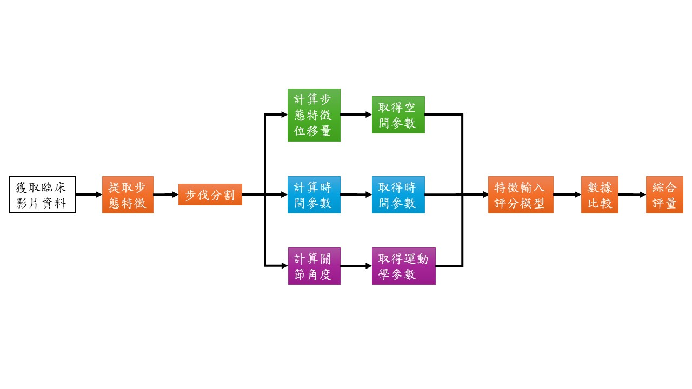

# Gait Abnormality Detection — 步態異常偵測與嚴重度評估

## 📌 Overview
本專案旨在開發一套基於 Python 與深度學習的步態異常偵測系統，  
透過 MMPose 進行人體姿態估計，結合 CNN + LSTM 架構預測高精度關節角度，  
並進一步以 Z-score 與 CI 距離量化異常程度，實現步態異常自動標記與嚴重度分級。

此系統適用於居家照護環境，可協助使用者與照護者及早發現步態異常，降低跌倒風險。

---

## 🧰 Technologies
- **Python**
- **MMPose**：姿態估計
- **CNN + LSTM**：關節角度模擬與時間序列學習
- **Z-score, CI 計算**：異常度量化
- **Matplotlib**：結果可視化

---

## 🎯 Key Features
- 以 MMPose 擷取步態關節點
- CNN + LSTM 模型模擬 MoCap 等級精度
- 自動計算每一關節異常分數 (Z-score)
- 根據標準差區間自動分級（輕微、中度、嚴重）
- 生成報告與可視化圖表

---

## 📊 System flow chart

| 系統流程 |
|----------|
|  |

