# Python 影像特效系統 | Image Effects with Python

## 📌 Overview
本專案使用 Python 與 OpenCV 實作多種影像特效處理，  
包含像素化、模糊、運動模糊、放射狀模糊、漣漪、魚眼、捻轉，以及非真實感繪製（NPR）效果，  
可作為數位影像處理與電腦視覺練習示例。

---

## 🧰 Technologies
- **Python**
- **OpenCV**：影像處理與濾鏡效果
- **NumPy**：矩陣與圖像陣列運算
- **Matplotlib**：顯示圖像

---

## ✨ Main special effects categories
### 1️⃣ 特效處理基礎
- 漣漪、魚眼、捻轉等

### 2️⃣ 像素特效
- 模糊、運動模糊、放射狀模糊

### 3️⃣ 非真實感繪製 (NPR)
- 鉛筆素描、懷舊、光照、流年等

---

## 📂 How to Run
```bash
# 安裝必要套件
pip install opencv-python numpy matplotlib

# 執行 Python 腳本
python code/漣漪特效.py
python code/魚眼特效.py
python code/捻轉特效.py

python code/模糊特效.py
python code/運動模糊.py
python code/放射狀模糊.py

python code/鉛筆素描.py
python code/懷舊.py
python code/光照特效.py
python code/流年特效.py
python code/風格化.py
```

---

## 📊 Demo
以下為本專案簡報說明影片：
[👉 點此觀看 Demo 影片](https://drive.google.com/file/d/1WSdk_P8cQOyDvhP1AAoJEKsUPD1LzJbW/view?usp=sharing)


---

## 📊 Demo Image examples

| 原圖 | 特效結果1 | 特效結果2 | 特效結果3 |
|------|-----------|-----------|-----------|
| 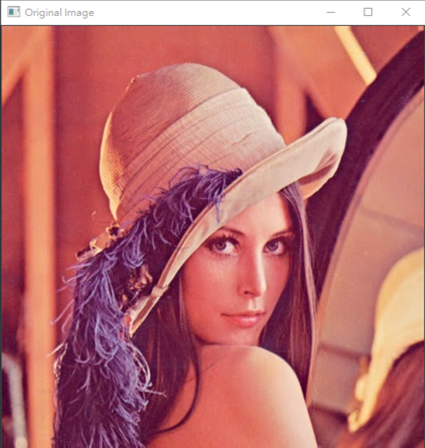 | 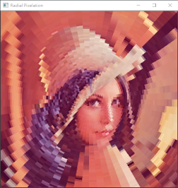 |  |  |
| 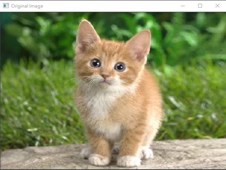 | 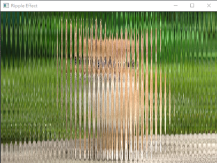 | 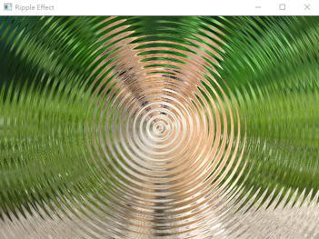 |  |
| 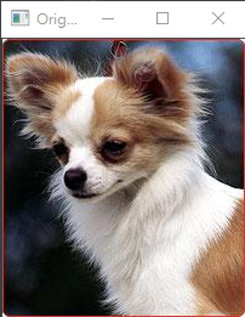 | 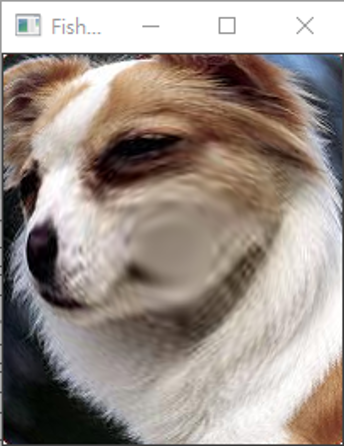 | 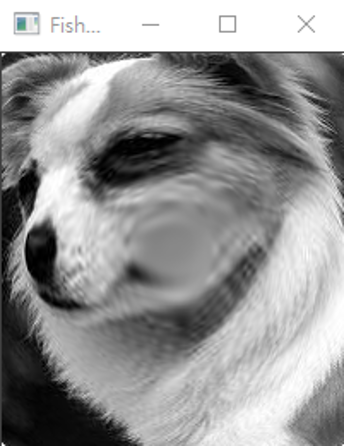 |  |
| 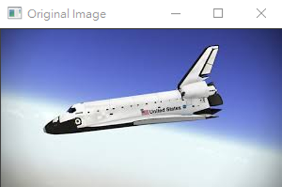 | 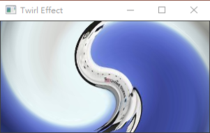 | 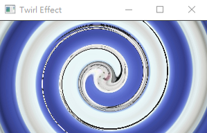 | 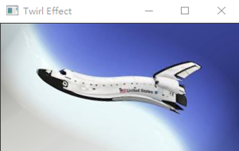 |
| 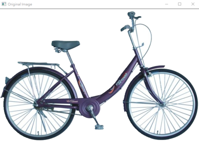 | 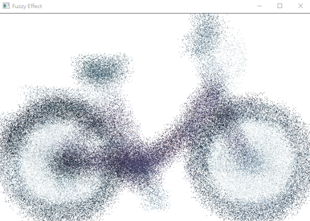 |  |  |
| 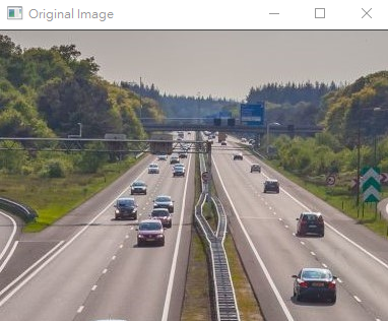 | 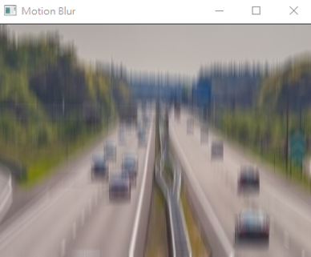 | 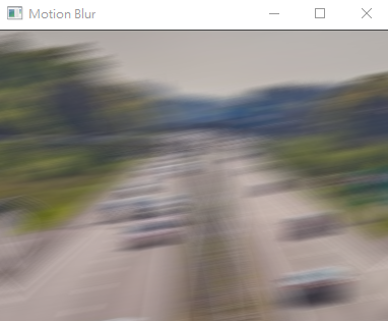 |  |
| 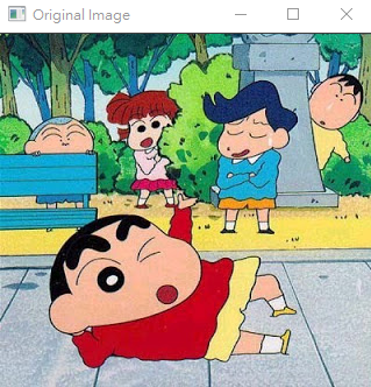 |  |  |  |
| 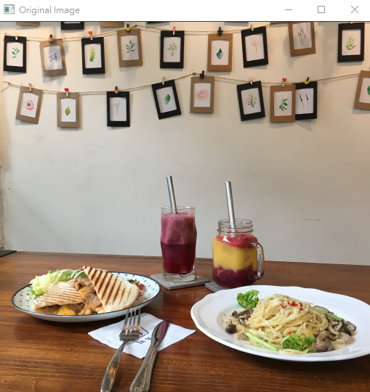 | 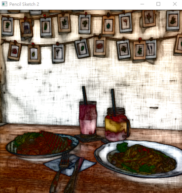 | 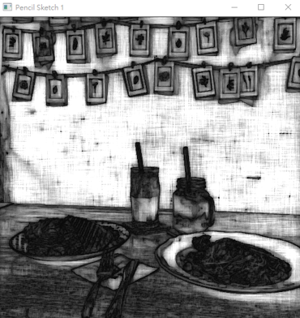 | 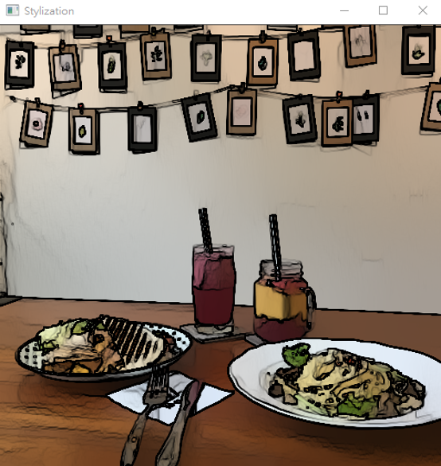 |
|  | 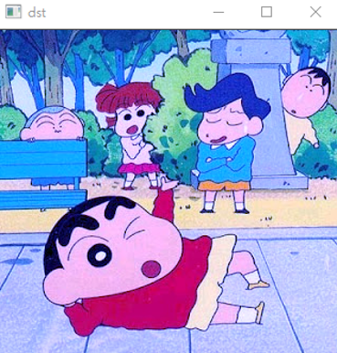 |  |  |


## 📄 Related Report
[👉 點此下載 PDF 文字說明檔](./report_word.pdf)

[👉 點此下載 PPT 簡報檔](./report_ppt.pdf)
