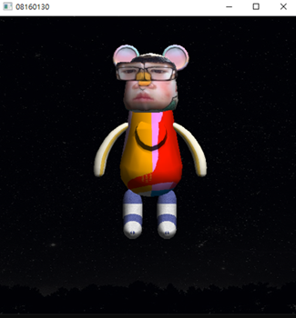

# Computer Graphics — Kubrick Bear Robot Dance (C + Maya)

## 📌 Overview
本專案結合 Maya 3D 建模與 C 語言 OpenGL 動畫控制，  
以庫柏力克熊公仔為基礎，模擬機器人風格的擺動動作，並配合音樂同步演示。

---

## 🧰 Technologies
- **C Language + OpenGL**：動畫控制、音樂同步
- **Code::Blocks**：專案管理
- **Autodesk Maya**：多邊形造型、公仔材質

---

## 🎯 Key Features
- 以 Maya 建立庫柏力克熊造型
- 使用 C 語言撰寫動畫控制程式，實現機器人般的分節擺動
- 配合音樂播放同步，動作與節奏結合
- 多角度渲染示範 + Demo 影片展示最終動作

---

## 📂 How to Run
```bash
# 確保系統已安裝 OpenGL 與 GLUT

1. 使用 Code::Blocks 開啟 `bear_animation.cbp` 專案檔
2. 編譯後執行，播放音樂並自動驅動動畫
```

---

## 📊 Demo
[👉 點此觀看 Demo 影片](https://drive.google.com/file/d/1GkzTUIzoY0sLed-Lyp2-eICbSErxyZVk/view?usp=sharing)


