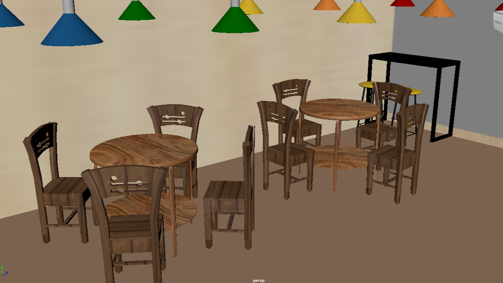

# Maya — 個人風格咖啡廳 3D 建模 | My Personal Café 3D Design (Maya)

## 📌 Overview
本專案以 Autodesk Maya 製作，從零開始設計一間符合自己飲食習慣與生活理念的咖啡廳，  
包含建築外觀、室內空間與場景擺設，並嘗試大膽色彩搭配，呈現與眾不同的前衛風格。  
除空間設計外，也進一步練習了人物與物件的基礎建模，豐富整體視覺層次。

---

## 🧰 Technologies
- **Autodesk Maya**
- **Arnold Render**（或 Maya 內建渲染器）

---

## 🎯 Key Features
- 完整內部空間設計與簡易建築外觀
- 使用前衛色彩方案強化個人風格
- 細節包含吧台、座位、擺設等符合個人飲食習慣

---

## 📸 Pictures

<table>
  <!-- 區塊 1: 建築外觀 -->
  <tr>
    <th>建築外觀</th>
    <th>建築外觀</th>
    <th>蛋糕展示櫃</th>
    <th></th>
  </tr>
  <tr>
    <td></td>
    <td></td>
    <td></td>
    <td></td>
  </tr>

  <!-- 區塊 2: 座位區 -->  <!-- 區塊 3: 櫃台與吧檯 -->
  <tr>
    <th>座位區</th>
    <th>座位區</th>
    <th>櫃台與吧檯</th>
    <th>櫃台與吧檯</th>
  </tr>
  <tr>
    <td></td>
    <td></td>
    <td></td>
    <td></td>
  </tr>

  <!-- 區塊 4: 製冰機 & 磨豆機 -->  <!-- 區塊 5: 義式咖啡機 -->
  <tr>
    <th>製冰機</th>
    <th>磨豆機</th>
    <th>義式咖啡機</th>
    <th>義式咖啡機</th>
  </tr>
  <tr>
    <td></td>
    <td></td>
    <td></td>
    <td></td>
  </tr>

  <!-- 區塊 6: 結帳機 & 回收台 -->
  <tr>
    <th>結帳機</th>
    <th>回收台</th>
    <th></th>
    <th></th>
  </tr>
  <tr>
    <td></td>
    <td></td>
    <td></td>
    <td></td>
  </tr>
</table>
